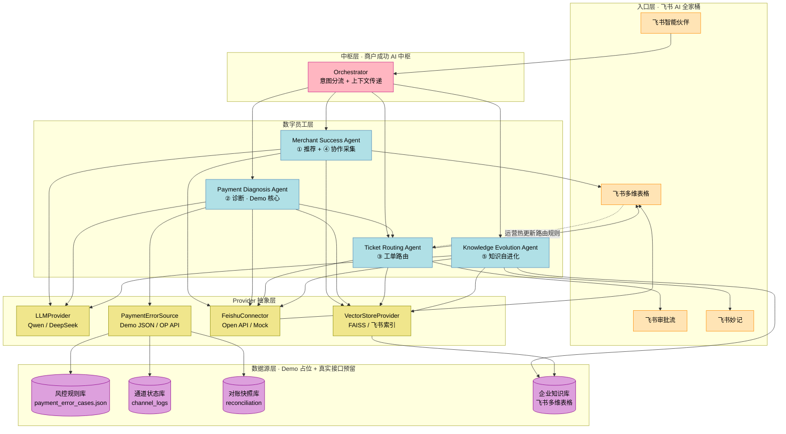

# Agent 协作架构图（4 业务 Agent + 商户成功 AI 中枢）

> 对应 Phase 2.2 · OceanMate AI 多 Agent 协作架构
> 关联文档：`docs/architecture/solution_overview.md`、`docs/agents/*.md`

---

## 1. 整体架构（5 层分层）

---

## 2. 4 Agent 协作矩阵

| 协作关系 | 触发场景 | 数据契约 | 协议位置 |
|---------|---------|---------|---------|
| **中枢 → 4 Agent** | 商户提问意图分流 | `problem_record` JSON | `agents/protocols.py` |
| **MSA → PDA** | 商户采集后转诊断 | `merchant_context + diagnosis_request` | `protocols/transfer.py` |
| **PDA → TRA** | 诊断后自动派单 | `diagnosis + ticket_draft` | `protocols/transfer.py` |
| **TRA → KEA** | 工单结案触发沉淀 | `ticket + resolution` | `protocols/transfer.py` |
| **KEA → MSA/PDA** | 下次同类问题自动命中 | `case_id + faq_summary` | RAG 检索层 |
| **4 Agent → 中枢** | 上下文回流 | `next_agent + state` | `protocols/orchestrator.py` |
| **运营 → TRA**（飞书）| 修改 SLA / 责任团队 | 多维表格热更新 | 飞书 API |

---

## 3. Provider 抽象层（PoC 与真实环境切换的关键）

| Provider 接口 | PoC 实现 | 真实环境实现（占位）| 切换成本 |
|-------------|---------|------------------|---------|
| `LLMProvider` | Qwen (DashScope OpenAI-compat) | 同左 + DeepSeek 备选 | 1 个工厂函数 |
| `VectorStoreProvider` | 本地 FAISS / Chroma | 飞书多维表格 + 向量索引 | 1 个 Adapter |
| `FeishuConnector` | Mock client + 文档截图 | 飞书官方 Open API | 1 个 Adapter |
| `PaymentErrorSource` | `docs/data/payment_error_cases.json` | OP 风控 / 通道 / 对账 API | 1 个 Adapter |

> **设计意图**：PoC 与真实环境**仅通过替换 Adapter 实现切换**，业务代码（4 Agent）零改动。

---

## 4. AtoA 协议 + MCP 扩展预留

### 当前状态（PoC）

- Agent 间通过中枢 Orchestrator 传递 JSON Schema（见 `docs/agents/<name>/protocols.py`）
- 单进程内函数调用 + 共享内存
- **不引入 MCP / AtoA 完整依赖**（2 天冲刺不可行）

### 扩展预留

- 每个 Provider 接口预留 `tool_spec` 描述（JSON Schema 形式）
- 对接真实环境时，可**直接转 MCP tool 协议**（Anthropic MCP 标准）
- Agent 间协议升级到 AtoA 时，**仅替换 Orchestrator 实现即可**

### 不在 PoC 范围

- 完整 Agent-to-Agent（AtoA）协议栈
- A2A Discovery（Agent 注册中心）
- 跨进程消息总线（Kafka / Redis Pub-Sub）
- 协议级鉴权 + 加密

---

## 5. 飞书生态绑定（运营侧能力来源）

| 飞书组件 | 在本方案中的角色 | 关键能力 |
|---------|--------------|---------|
| **飞书智能伙伴** | 商户对话入口 | 承接意图分流 / 与中枢对接 |
| **飞书多维表格** | 工单池 / 知识库 / 商户画像 / 路由规则表 | 100 万行/表 + AI 智能标签 + 运营热更新 |
| **飞书审批流** | SLA 路由触发 + 工单状态跟踪 | 动态审批节点 + 数据回写 |
| **飞书妙记** | 会议/语音记录 → 自动入知识库 | 实时转写 + 关键词索引 |
| **多维表格 AI 字段** | 智能标签 + 仪表盘 | 运营管理可视化 |

---

## 6. 与赛事命题的对齐点

| 命题要求 | 本架构对位 | 证据 |
|---------|----------|------|
| 飞书 AI 全家桶深度使用 | ✅ 5 个组件全部对接 | 本节 §5 |
| A2A / MCP 关键词保留 | ✅ Provider 抽象 + 扩展预留 | 本节 §3 §4 |
| AI 驱动（非"AI 加持"）| ✅ 4 类业务数字员工 + 中枢协同 | §1 数字员工层 |
| 跨境 + 商户成功 | ✅ 4 Agent ↔ OP 5 方向 | `docs/business/merchant_success.md` |
| 数据真实可追溯 | ✅ 证据链 + Provider 占位符系统 | `docs/agents/payment_diagnosis_agent.md` §5 |
