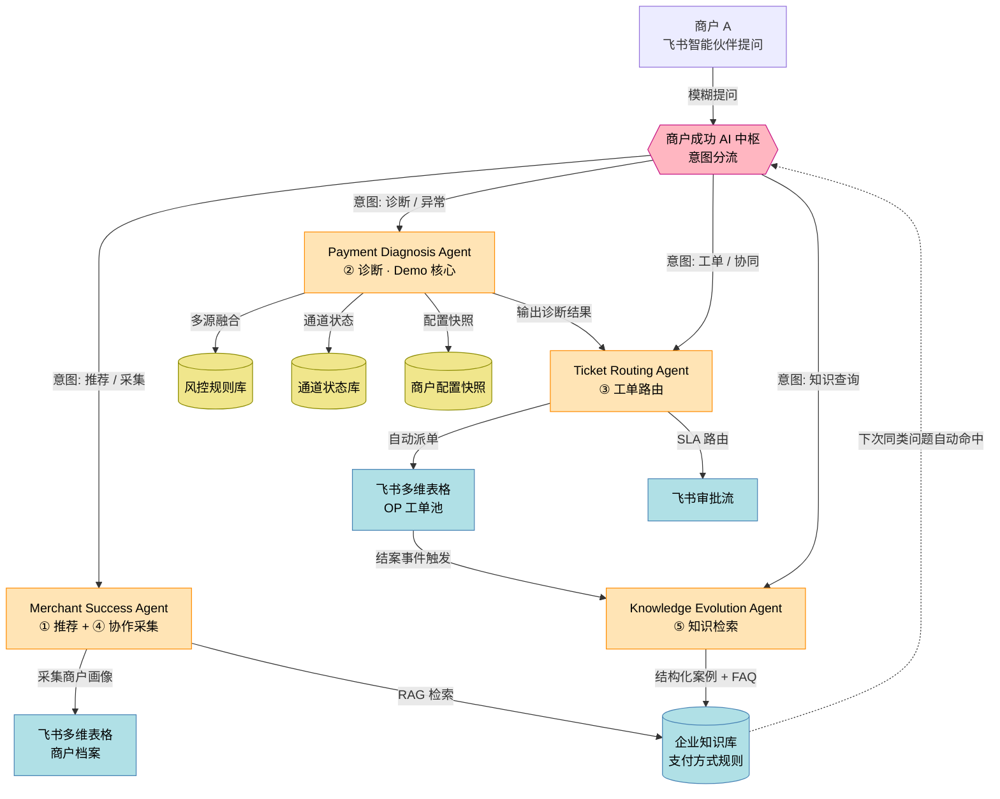

# 业务流图（商户 → AI 中枢 → 4 Agent → 飞书生态）

> 对应 Phase 2.1 · OceanMate AI 端到端业务流
> 关联文档：`docs/agents/*.md`、`docs/architecture/solution_overview.md`

---

## 1. 流程总览（4 Agent 协作 · 商户全生命周期）



---

## 2. 关键场景走查（3 个核心场景）

### 场景 A · 商户咨询支付方式（MSA 主导）

```
商户 → 飞书智能伙伴: "我想做美国站，帮我选支付方式"
                              ↓
              [商户成功 AI 中枢] 识别意图: 推荐
                              ↓
MSA 主动反问: 国家 / 客单价 / 目标用户 / 行业
                              ↓
MSA 画像匹配 + RAG 检索支付方式规则库
                              ↓
MSA 输出推荐组合（Visa/Mastercard/ACH/PayPal · 含证据链）
                              ↓
商户: "还可以接入吗？"
                              ↓
MSA 辅助接入准备（输出对接清单）
                              ↓
结果沉淀：商户档案写入飞书多维表格
```

### 场景 B · 商户支付失败（PDA 主导 · Demo 核心）

```
商户 → 飞书智能伙伴: "订单 Oxxx 失败，错误码 Exxx"
                              ↓
              [商户成功 AI 中枢] 识别意图: 异常诊断
                              ↓
PDA 多源融合：
  • 风控规则库（risk_rule）
  • 通道状态库（channel_status）
  • 商户配置快照（config_snapshot）
                              ↓
PDA 输出: 问题类型 + 根因 + 证据链
                              ↓
TRA 自动派单: 技术团队（SLA 由规则表计算）
                              ↓
飞书多维表格新增工单（T<YYYYMMDD>xxx）
                              ↓
商户收到工单号 + 责任人 + SLA 到期时间
```

### 场景 C · 工单结案后自进化（KEA 主导 · 闭环关键）

```
工单结案 → TRA 触发结案事件 → KEA
                              ↓
KEA 抽取案例特征（problem_type + country + channel + error_code）
                              ↓
KEA 生成结构化案例 + FAQ 草稿
                              ↓
写入飞书多维表格「OP 企业知识库」表
                              ↓
RAG 索引自动更新
                              ↓
下次同类商户提问 → MSA/PDA 自动命中 → 自助解决率 ↑
```

---

## 3. 中枢调度矩阵

| 商户意图 | 主 Agent | 协作 Agent | 飞书出口 | 中枢输出 |
|---------|---------|-----------|---------|---------|
| 支付方式咨询 / 接入 | MSA | — | 多维表格（画像沉淀）| 推荐组合 + 接入清单 |
| 商户模糊提问待采集 | MSA | 按需转 PDA/TRA | 多维表格 | `problem_record` 结构化档案 |
| 支付失败 / 风控拦截 | PDA | TRA | 多维表格 + 审批流 | 诊断结果 + 自动工单 |
| 拒付 / 退款异常 | PDA | TRA → 财务团队 | 同上 | 诊断 + 财务派单 |
| Webhook 回调失败 | PDA | TRA → 技术团队 | 多维表格 + 审批流 | 诊断 + 技术派单 |
| 工单协同 / 状态查询 | TRA | KEA（FAQ 检索）| 多维表格 | 工单状态 + SLA |
| 知识查询 / FAQ | KEA | MSA（若意图变推荐）| 飞书文档 | FAQ 内容 |

---

## 4. 与 OP 5 个核心业务方向的对应

| OP 方向 | 主 Agent | 在流图中的位置 |
|--------|---------|---------------|
| ① 支付方式推荐 | MSA | 场景 A |
| ② 异常诊断（拒付/退款/失败）| PDA | 场景 B |
| ③ 工单智能路由 | TRA | 场景 B 末尾 |
| ④ 数据协作采集 | MSA（中枢协同）| 场景 A 前置 |
| ⑤ 知识沉淀 | KEA | 场景 C |
